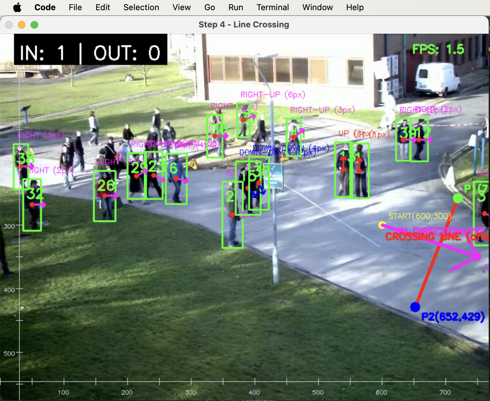

# Hệ Thống Theo Dõi Người với YOLOv8 + DeepSORT

Ứng dụng theo dõi và đếm người qua các vạch kẻ trong video bằng computer vision.

## 📋 Demo


## 🚀 Hướng Dẫn Cài Đặt

### macOS
```bash
# Tạo môi trường ảo
/opt/homebrew/bin/python312 -m venv .venv
source .venv/bin/activate

# Cài đặt thư viện
pip install ultralytics supervision opencv-python deep-sort-realtime pyqt5

# Chạy ứng dụng
python main.py
```

### Windows (Git Bash)
```bash
# Tạo môi trường ảo
/c/Users/admin/AppData/Local/Programs/Python/Python312/python.exe -m venv .venv
source .venv/Scripts/activate

# Cài đặt thư viện
pip install ultralytics supervision opencv-python deep-sort-realtime pyqt5

# Chạy ứng dụng
python main.py
```

### Chạy từng bước học tập
```bash
python src/step1_stream.py    # Stream video cơ bản
python src/step2_detect.py    # Phát hiện người
python src/step3_track.py     # Theo dõi ID
python src/step4_line_cross.py # Phát hiện qua vạch
```

## 🔧 Luồng Xử Lý 

### Kiến trúc hệ thống
```
Camera/Video → YOLOv8 → DeepSORT → Logic vạch kẻ → Đếm người
```

### Công nghệ sử dụng
- **YOLOv8n**: Phát hiện người (class 0) với độ tin cậy > 0.4
- **DeepSORT**: Theo dõi ID liên tục, chống nhầm lẫn
- **Supervision**: Quản lý vạch kẻ và hiển thị
- **OpenCV**: Xử lý video và hiển thị
- **PyQt5**: Giao diện người dùng

### Thuật toán đếm
- Theo dõi tọa độ tâm `(cx, cy)` giữa các frame
- Sử dụng vùng offset để tránh đếm sai
- Phân biệt hướng IN/OUT dựa trên vector chuyển động 2D

### Cấu trúc code
```
src/step1_stream.py     # Bước 1: Stream video
src/step2_detect.py     # Bước 2: Phát hiện YOLOv8  
src/step3_track.py      # Bước 3: Theo dõi DeepSORT
src/step4_line_cross.py # Bước 4: Logic qua vạch
main.py                 # Ứng dụng GUI hoàn chính
```